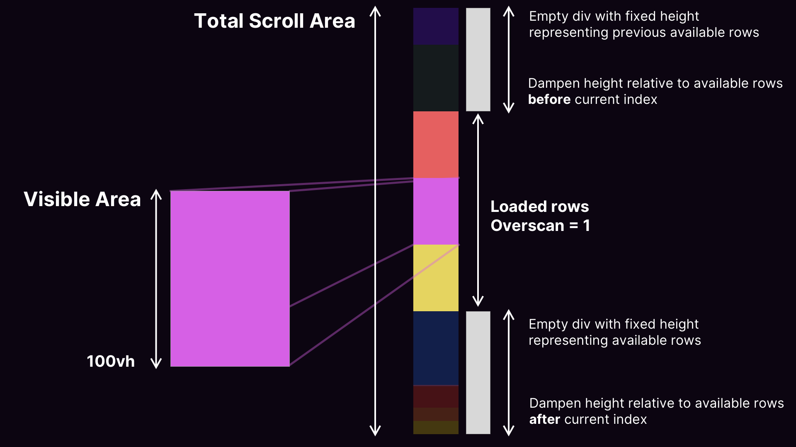

# React Virtual Infinite Scroll Demo

An introduction to how we can do list virtualization from scratch in React.

With this strategy, we will have a scrollable div with three children.

```html
<div className="overflow-y-auto" onScroll={handleUpdateVisibleArea}>
   <!-- Empty div with fixed height -->
  <div style={{ height: countRowsBeforeCurrentIndex * ROW_HEIGHT }} />
  <div>
      <!-- (Visible Area): Render visible row at current index + overscanned rows -->
  </div>
   <!-- Empty div with fixed height -->
  <div style={{ height: countRowsAfterCurrentIndex * ROW_HEIGHT }} />
</div>
```

## Resources used for inspiration

- https://dev.to/vt2730/react-virtualized-list-from-scratch-121j
- https://www.ag-grid.com/javascript-data-grid/dom-virtualisation/
- https://medium.com/@mukuljainx/smart-grid-lightweight-alternate-to-ag-grid-9d8c3d38c351

## Virtualization strategy illustrated



## Run the demo project

Make sure you are using node version ^20 (run `node -v`).

```bash
npm install
```

## Start the development server

```bash
npm run dev
```

This project was bootstrapped using my React Project recipe [https://github.com/gullskatten/react-tailwind-vite-ts-base](https://github.com/gullskatten/react-tailwind-vite-ts-base)
